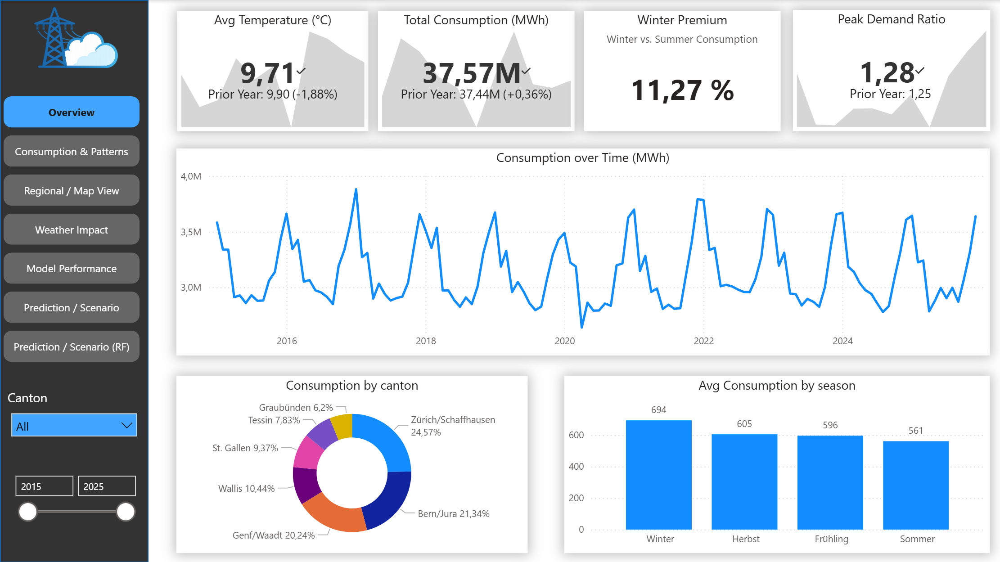
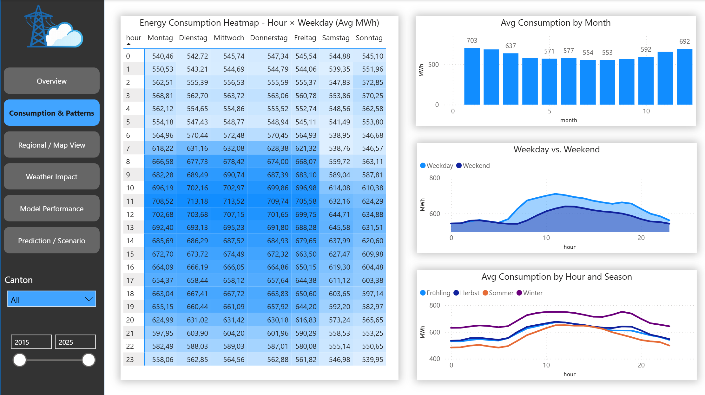
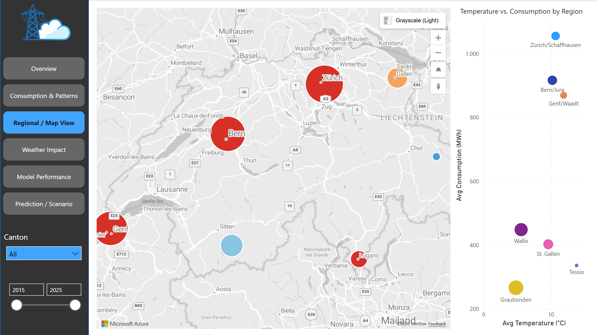
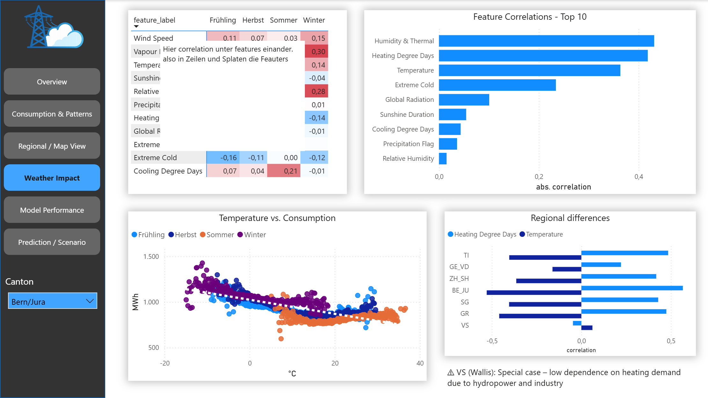
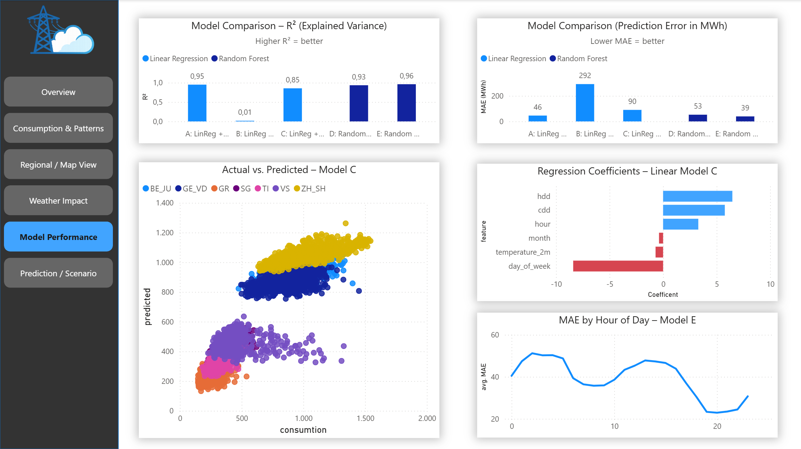
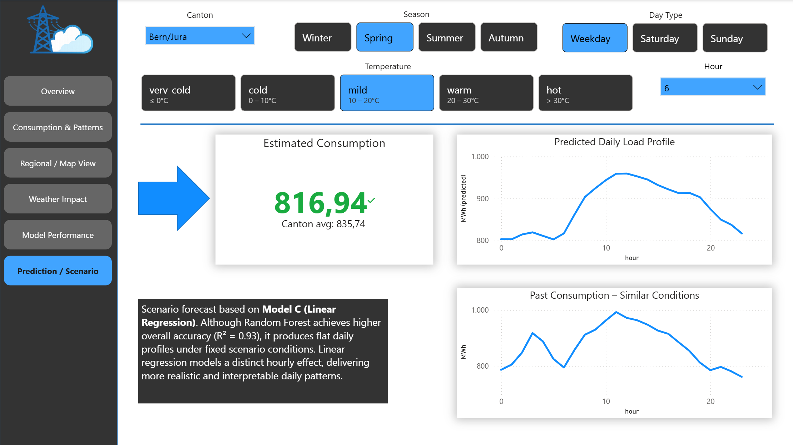

# Dashboard Documentation

This document provides an overview of the Power BI dashboard pages. Each section describes the purpose of a specific page, the key metrics displayed, and how the visuals support data-driven insights into electricity consumption and its influencing factors.

---

## Overview

This page provides a high-level summary of electricity consumption, key performance indicators, and overall trends over time. It enables users to quickly assess developments in consumption, seasonal effects, and regional distribution across Switzerland.

## Consumption & Patterns

This page provides a detailed analysis of electricity consumption patterns across different time dimensions. It highlights hourly, daily, and seasonal variations, enabling users to identify recurring patterns such as peak hours, weekday vs. weekend differences, and monthly trends.

## Regional / Map View

This page provides a geographical perspective on electricity consumption across different regions in Switzerland. It allows users to compare regional consumption levels and explore the relationship between temperature and energy usage across cantons.

## Weather Impact

This page analyzes the relationship between weather conditions and electricity consumption. It highlights key correlations between weather features and consumption, and shows how temperature and seasonal factors influence energy demand across regions.

## Model Performance

This page evaluates and compares the performance of different prediction models. It highlights model accuracy, prediction errors, and key drivers of the regression model, providing insights into how well consumption can be explained and predicted.

## Prediction / Scenario

This page enables users to simulate electricity consumption based on selected scenario parameters such as season, temperature, day type, and hour. It provides an estimated consumption value and compares the predicted load profile with historical patterns under similar conditions.

